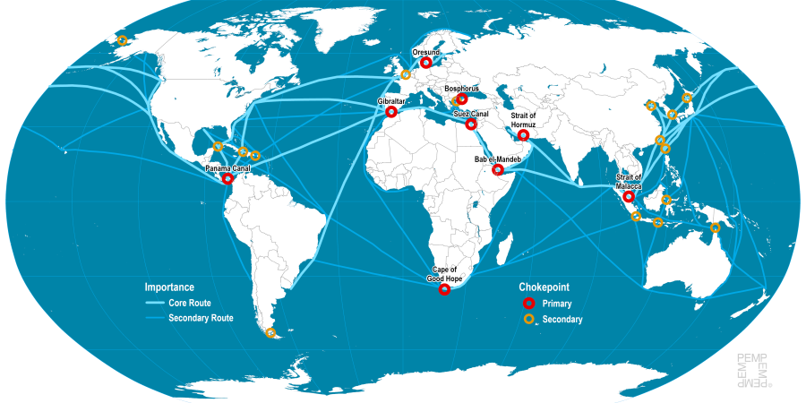
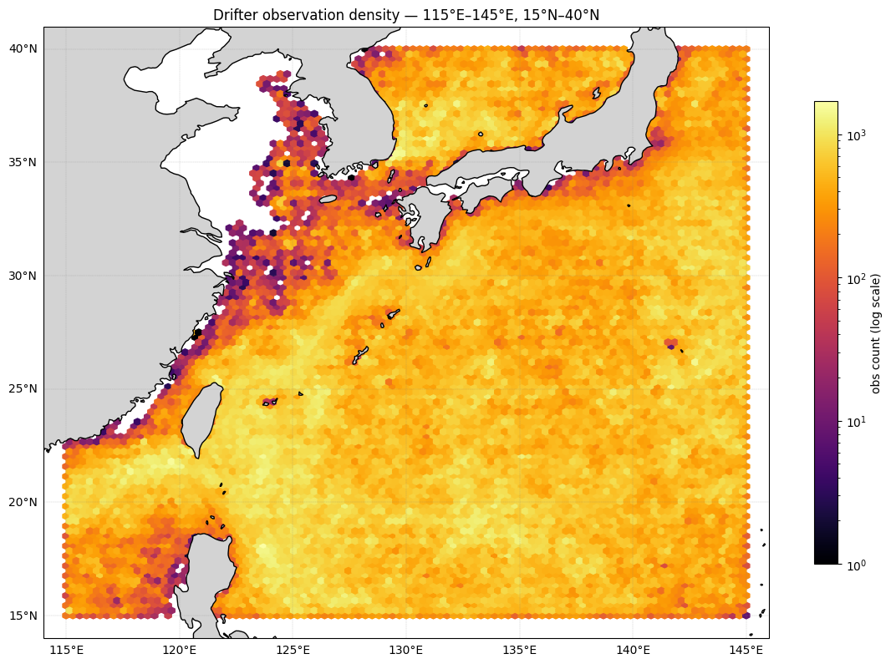
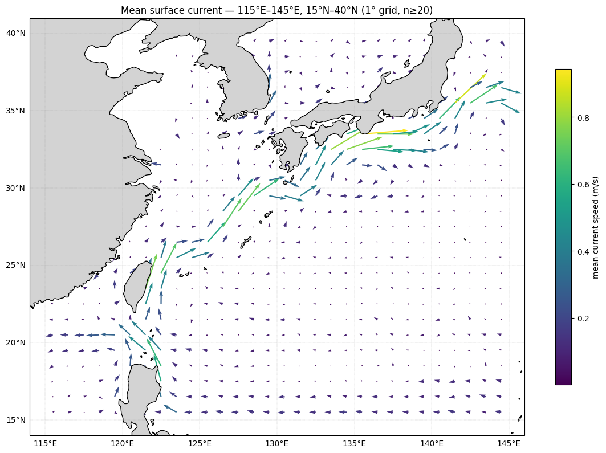
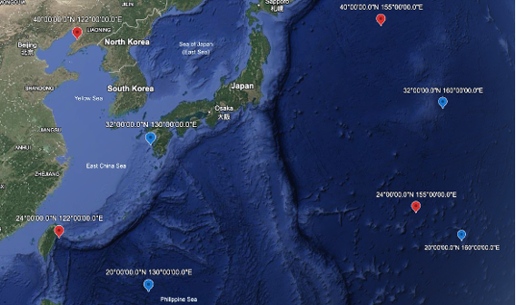

# GLOBAL DRIFTER PROGRAM

**DATA3001 — DATA SCIENCE AND DECISIONS IN PRACTICE — TERM 3, 2026**

## PROJECT PROPOSAL

*Group 6*

---

## CONTEXT

The ocean surface layer exchanges heat with the atmosphere, and carries pollutants, so understanding where and how fast surface water moves has both scientific and practical value. Ocean drifters are Lagrangian instruments that move with the water and record their own trajectories wherever the flow carries it, unlike Eulerian observations made at fixed locations. The NOAA Global Drifter Program (GDP) maintains a global array of thousands of drifters. Its hourly product contains 19 396 drifter trajectories and 197 214 787 hourly observations spanning from 1987 to 2022. Each observation records quality-controlled positions, eastward and northward velocities, and associated uncertainty estimates (Elipot et al. 2016), providing an observational basis for studying regional surface circulation.

Several studies have estimated mean surface circulation from drifters. Lumpkin and Johnson (2013) mapped drifter velocities onto spatial grids to estimate global time-mean and seasonal surface velocity fields with component-wise error estimates. Laurindo et al. (2017) improved on this approach by introducing a new velocity decomposition that reduces the smoothing of spatial gradients inherent in traditional data-binning methods and correcting wind-induced slip biases in undrogue drifters. For the Kuroshio specifically, Uchida and Imawaki (2003) showed that drifters preferentially sample the high-speed Kuroshio core, which can bias simple mean-velocity estimates, and therefore incorporated satellite altimeter data to correct for this bias. However, the corrected estimates remained sensitive to the drifters sampled in this region.

Overall, existing methods can estimate mean surface circulation and reduce some sources of bias, but the extent to which non-uniform, flow-dependent sampling affects the reliability of estimates across individual grid cells requires further assessment. Therefore, this study will estimate the mean surface circulation of the Kuroshio while evaluating sampling conditions and associated uncertainty on a cell-by-cell basis.

## PRELIMINARY EDA – CHOOSING A REGION

### *Global Scope*

*Figure 1: Global distribution of ocean drifters*

To select a study region, the global distribution of drifter observations was examined first, since heavy sampling supports more reliable analysis. Using a hexbin density map and plotting each drifter readings based on their coordinates, figure 1 reveals that sampling is not necessarily uniform, with drifters accumulating in regions of convergence and dispersing in divergent regions near the equator and the poles, showing early signs of flow dependent sampling.

Density alone cannot determine whether a heavily sampled region is oceanographically or economically important. In conjunction with a global figure of the mean surface current velocity measured by these drifters (figure 2), three strong currents stand out in well-sampled regions – The Gulf Stream in the East Coast of the US, The Kuroshio around Taiwan and Japan, and the Agulhas Current off the South-East coast of Africa.

*Figure 2: Global Mean Surface Current Velocity*

### *Regional Comparison*

Taking a closer look at these 3 major regions, each candidate was bounded by a rough box and compared on 1 degree cell grids. Spatial coverage refers to cells with at least one observation and reliable coverage refers to cells with at least 20 observations.

| Region | Gulf Stream | Kuroshio | Agulhas |
|---|---|---|---|
| Bounds (degrees) | 30-50 N, 50-80 W | 15-40 N, 115-145 E | 25-40 S, 15-40 E |
| Observations | 5,162,039 | 4,630,468 | 1,413,922 |
| Unique Drifters | 1,346 | 1,535 | 667 |
| Spatial Coverage (%) | 73.5 | 82.9 | 68.8 |
| Reliable Coverage (%) | 73.0 | 81.5 | 68.5 |

The Gulf Stream has the most total observations, but the Kuroshio is sampled by more unique drifters and has the highest spatial and reliable coverage. The Agulhas has the fastest mean flow but the fewest observations, drifters and coverage.

### *Economic Relevance*

Cross-referencing to global maritime shipping routes in figure 3 to assess economic importance, all three regions lie on major routes – the Gulf Stream along the North Atlantic and US East Coast, the Agulhas near the Cape of Good Hope port, and the Kuroshio within the dense East Asian network, with several secondary chokepoints around Taiwan, Korea and Japan.

*Figure 3: Maritime Shipping Routes and Chokepoints*

Shipping relevance therefore does not separate the candidates, but it confirms the valuable economic importance of Kuroshio in East Asian maritime trade. Combined with its higher sampling coverage, it is positioned as the top candidate for conducting our main thesis – "How much can non-uniform, flow-dependent sampling be trusted to estimate the climatology cell-by-cell?"

## PRELIMINARY EDA – KUROSHIO IN FOCUS

*Figure 4*

*Figure 5*

Within the selected boundaries, observation density (figure 4) is highest along the Kuroshio's path from east of Taiwan to the south coast of Japan and lowest on the Yellow Sea and inner shelf of the East China Sea. The gridded mean current (figure 5) shows a continuous jet from the northern Luzon of the Philippines, through east of Taiwan following the shelf break through the East China Sea and strengthens in the south of Japan, where mean speeds reach up to 0.9m/s. Sampling is evidently more concentrated along the flow and more sparse surrounding it, so mean estimates rest on different amounts of data, which motivates our project in assessing reliability cell by cell.

*Figure 6: Satellite view of Kuroshio Region*

## PROJECT DIRECTION

The study will focus on the Kuroshio region in the western North Pacific, using an initial study domain of 115°E–145°E and 15°N–40°N. The Kuroshio is a warm western boundary current characterised by a strong but spatially variable flow and a changing current path. This makes the region suitable for investigating the time-averaged surface circulation of the Kuroshio Stream region, and how much can non-uniform, flow-dependent drifter sampling be trusted to estimate it, cell by cell? The geographical boundaries are treated as an explicit analytical study domain rather than the physical boundaries of the Kuroshio itself.

### *Thesis Question*

What is the time-averaged surface circulation of the Kuroshio Stream region, and how much can non-uniform, flow-dependent drifter sampling be trusted to estimate it, cell by cell?

### *Supporting Questions*

1. Where is the Kuroshio Current mean position and speed, as recovered from binned drifter velocities, and does it match the well-documented jet position and speed patterns from independent sources like satellite altimetry?
2. Where do raw observations counts overstate the independent information in a cell?
3. In which cells is the mean velocity reliable and how large is its uncertainty compared with the mean flow? Are the densely sampled cells of the East China Sea continental shelf break actually more uncertain in a meaningful sense even though they have more raw data points?
4. What does an appropriately weighted/debiased mean look like versus the naive unweighted mean? Is sampling density related to local flow speed and does that relationship differ between the jet corridor and the recirculation zone.
5. How does the mean flow, and the confidence in it, vary seasonally, does the Stream's path shift position by season, and does the uncertainty metric shrink or grow accordingly?

### *Objectives*

1. Estimate the time-averaged surface circulation of the Kuroshio region on a spatial grid and visualise it, checking that the recovered jet position and speed are consistent with published descriptions.
2. Quantify spatial variation in drifter sampling cell-by-cell using raw observation counts, distinct drifters and effective independent sample sizes.
3. Estimate per-cell uncertainty in the mean velocity by resampling with whole drifter trajectories and map where estimates are reliable.
4. Identify where high drifter density reflects current strength versus residence-time bias in the recirculation zone.
5. Examine whether the circulation varies seasonally in well-sampled grid cells.

## TIMELINE

| Weeks | Milestones | Objectives |
|---|---|---|
| 1-3 | Finalise region/grid resolution; complete batched EDA; confirm per-cell data sufficiency. | 1 |
| 3-5 | Build baseline naive gridded climatology and core visualizations. | 1, 2 |
| 5-7 | Implement block-bootstrap and effective-sample-size uncertainty estimators | 3, 4 |
| 7-8 | Implement seasonal decomposition; validate jet position/transport against literature. | 5 |
| 8-10 | Package the reusable gridded-climatology product; finalise write-up and figures. | All |

### Feasibility and Risk

Each stage produces a usable intermediate artefact; the naive gridded climatology is already a complete, but unadjusted, product, so later stages add rigour without blocking delivery if time runs short. The main risk is thin sampling in specific cells of the recirculation gyre. If per-cell counts prove too low for bootstrap resampling, the grid resolution will be coarsened for that sub-region rather than the deadline being put at risk.

## SIGNIFICANCE

Surface drifters provide direct observations of near-surface ocean motion and are widely used to characterise ocean circulation. However, the reliability of circulation estimates depends not only on the total number of observations but also on where, when and how independently they were collected. Because drifters move with the circulation itself, their sampling is inherently non-uniform and potentially flow-dependent. Some grid cells may therefore contain many observations from only a small number of trajectories, while others are supported by a broader set of independent drifters. Without accounting for this difference, a mean-flow map may give the impression that circulation estimates are equally reliable throughout the study region.

Evaluating reliability at the grid-cell level is therefore scientifically important. Rather than producing only a map of mean surface velocity, this project aims to quantify the observational support and uncertainty associated with each local estimate. Combining the estimated mean flow with measures such as observation counts, numbers of distinct drifters and uncertainty can help distinguish strongly supported circulation features from estimates that should be interpreted cautiously. This is particularly relevant in a dynamically variable current such as the Kuroshio.

Reliable estimates of surface circulation also have broader practical and environmental relevance. Surface-drifter observations are used to study the dispersion of floating materials, including marine debris, oil and biological material, and contribute to the evaluation and improvement of ocean models. For oceanographers, observing programmes and environmental researchers, identifying where circulation estimates are strongly or weakly supported can improve the interpretation of observational circulation products. The project thus aims not only to describe the time-averaged Kuroshio circulation, but also to communicate where that description can be trusted and where observational limitations call for greater caution.

## REFERENCES

Elipot, S, Lumpkin, R, Perez, RC, Lilly, JM, Early, JJ & Sykulski, AM 2016, 'A global surface drifter data set at hourly resolution', *Journal of Geophysical Research: Oceans*, vol. 121, no. 5, pp. 2937–2966, DOI:10.1002/2016JC011716.

Laurindo, LC, Mariano, AJ & Lumpkin, R 2017, 'An improved near-surface velocity climatology for the global ocean from drifter observations', *Deep Sea Research Part I: Oceanographic Research Papers*, vol. 124, pp. 73–92, DOI:10.1016/j.dsr.2017.04.009.

Lumpkin, R & Johnson, GC 2013, 'Global ocean surface velocities from drifters: Mean, variance, El Niño–Southern Oscillation response, and seasonal cycle', *Journal of Geophysical Research: Oceans*, vol. 118, no. 6, pp. 2992–3006, DOI:10.1002/jgrc.20210.

Uchida, H & Imawaki, S 2003, 'Eulerian mean surface velocity field derived by combining drifter and satellite altimeter data', *Geophysical Research Letters*, vol. 30, no. 5, DOI:10.1029/2002GL016445.

Waseda, T, Mitsudera, H, Taguchi, B & Yoshikawa, Y 2003, 'On the eddy-Kuroshio interaction: Meander formation process', *Journal of Geophysical Research: Oceans*, vol. 108, no. C7, DOI:10.1029/2002JC001583.
