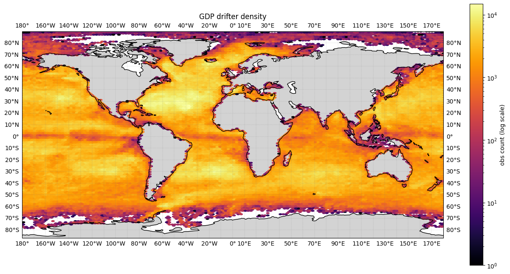
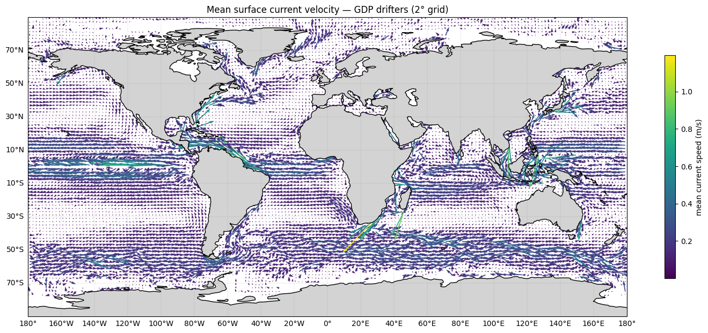
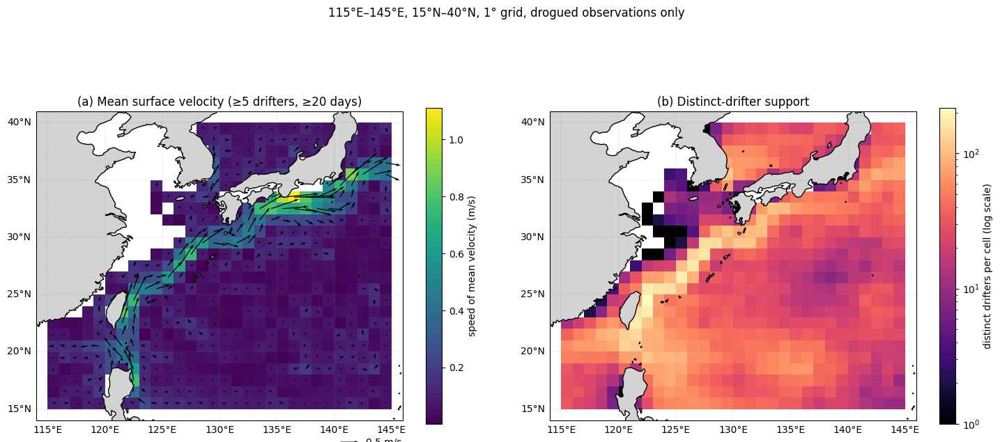

# GLOBAL DRIFTER PROGRAM

DATA3001 DATA SCIENCE AND DECISIONS IN PRACTICE | TERM 3, 2026

## PROJECT PROPOSAL

8 October 2026

Group 6

---

## PROJECT DIRECTION

### *Thesis Question*

What is the time-averaged surface circulation of the Kuroshio region, and how much can non-uniform, flow-dependent drifter sampling be trusted to estimate it, cell by cell?

### *Supporting Questions*

1. Where are the Kuroshio's mean axis and peak speed, as recovered from binned drifter velocities, and do they match independent estimates from satellite altimetry?
2. Where do raw observation counts overstate the independent information in a cell?
3. In which cells is the mean velocity well supported, and how large is its uncertainty compared with the mean flow? Are heavily observed cells along the East China Sea shelf break more uncertain than their raw counts suggest?
4. How sensitive is the estimated mean circulation to alternative weighting choices, such as hourly-observation weighting versus equal-drifter weighting?
5. How do the mean flow and its uncertainty vary seasonally, and does the current's path shift by season?

### Objectives

1. Estimate the time-averaged surface circulation of the Kuroshio region on a 1° grid and visualise it, validating the recovered jet axis and peak speed against altimetry and published descriptions.
2. Quantify spatial variation in drifter sampling cell-by-cell using raw observation counts, distinct drifters, temporal coverage and effective independent sample sizes.
3. Estimate per-cell sampling uncertainty in the mean velocity with a whole-drifter bootstrap, and produce aligned maps of mean velocity, distinct-drifter support and uncertainty.
4. Examine how alternative weighting schemes affect the estimated circulation, and whether differences are associated with current strength or longer drifter residence times in the recirculation zone.
5. Estimate seasonal mean fields and their bootstrap uncertainty in well-supported cells, and test whether the jet's position shifts by season.

### Data/Region Description

The study will focus on the Kuroshio region in the western North Pacific, using an initial study domain of 115°E–145°E and 15°N–40°N. The Kuroshio is a warm western boundary current; the domain covers it from the Luzon Strait, past Taiwan and along the East China Sea shelf break, to south of Japan, together with the recirculation gyre to the south. The geographical boundaries are treated as an explicit analytical study domain rather than the physical boundaries of the Kuroshio itself. This region contains 4,630,468 hourly observations from 1,535 drifters. We use GDP hourly version 2.01, accessed through CloudDrift's gdp1h(). The variables used are position, time, eastward and northward velocity with their error estimates and drogue-loss date and status.

---

## CONTEXT

### Background

Surface drifters provide Lagrangian observations of ocean motion by moving with the flow of water, unlike Eulerian observations made at fixed locations by other instruments like moorings. The NOAA Global Drifter Program (GDP) maintains a global array of about 1,300 drifters, with roughly 25,000 deployed since the late 1980s. Its hourly product contains 19,396 drifter trajectories and 197,214,787 hourly observations spanning from 1987 to 2022. Each observation provides quality-controlled positions, eastward and northward velocities, and associated uncertainty estimates, enabling regional surface-circulation analysis (Elipot et al. 2016).

### Existing studies/Solutions

Previous studies demonstrate both the feasibility and limitations of estimating surface circulation from drifters. Lumpkin and Johnson (2013) constructed gridded time-mean and seasonal velocity fields with uncertainty estimates, while Laurindo et al. (2017) improved drifter-based climatology by addressing spatial smoothing and wind-induced slip in undrogued drifters. In the Kuroshio, Uchida and Imawaki (2003) showed that preferential sampling of the high-speed current can bias mean-velocity estimates, highlighting the importance of evaluating sampling support. However, few of these studies examines cell by cell within one region, how many independent drifters support each estimate or how sensitive the mean is to weighting.

### Significance

Because drifters move with the circulation, their sampling is non-uniform and potentially flow-dependent. Some cells contain many observations from only a few trajectories, while others are supported by many independent drifters. A mean-flow map that ignores this suggests every estimate is equally reliable. This project therefore quantifies the support and uncertainty behind each cell's estimate, distinguishing well-supported features from those that should be interpreted cautiously. This matters especially in a variable current such as the Kuroshio.

Reliable surface-circulation estimates also have practical value. Drifter-based currents are used to track the dispersion of marine debris, oil and biological material, and to evaluate ocean models. Knowing where these estimates are strongly or weakly supported helps oceanographers, observing programmes and environmental researchers interpret them correctly.

---

## PROPOSED METHOD

### Drogue Policy

A drogued drifter follows the current at 15 m depth to within about 1 cm/s; after the drogue is lost, wind slip makes recorded velocity systematically too fast (Laurindo et al. 2017). Each observation is classed using the drogue_status flag checked against the drifter's drogue_lost_date, and counts as drogued or undrogued only if a lost date exists and agrees with the flag.

Drogued observations (status true, time before the lost date) are the only data used for the primary velocity estimates (P1). This includes drifters whose lost date equals their end of record, since the drogue plausibly stayed on until the record ended and their mean speed (0.35 m/s) is not higher than that of other drogued drifters (0.37 m/s). Excluding them is run as a sensitivity check (P1s).

Undrogued observations (status false, time on or after the lost date) are excluded from velocity estimates. Their mean speed is about 7% higher (0.40 m/s), consistent with wind slip, although this comparison is partly confounded by where undrogued drifters sample. A cell-by-cell comparison of mean velocity with and without them (P2) provides the direct test.

Unknown-status observations (no recorded lost date, or a flag that contradicts it) are excluded from all velocity estimates. They make up 5,877 of 4,630,468 observations (0.13%), almost all from seven drifters still active when the record ended, so they do not change support and are not analysed separately. Drogued speeds in the final 24 hours before grounding or pickup are not elevated, so no end-of-record trimming is applied.

Applying this policy removes more than half the observations, but coverage changes little.

| Measure | All observations | Drogued observations |
|---|---|---|
| Observations | 4,630,468 | 2,132,031 |
| Drifter coverage (>=5 distinct drifters) (%) | 77.2 | 74.9 |
| Temporal coverage (>=20 days) (%) | 77.9 | 74.5 |

*Table 1: Effect of Drogue policy on coverage*

### Mean Current Calculation

Mean velocity in each 1° cell is estimated as the vector mean of the eastward and northward components of drogued hourly observations over the full record. The baseline estimator gives every hourly observation equal weight. Because averaging within drifters or time periods first can produce different estimates, per-drifter averaging and equal weighting by month of year are evaluated as sensitivity checks against the baseline. Results are reported as the magnitude of the mean velocity vector, which differs from the average of individual speeds. Seasonal fields are computed the same way for each season (DJF, MAM, JJA, SON) in cells meeting the support thresholds. The recovered jet axis and peak speed are compared with altimetry-derived geostrophic currents and published descriptions.

### Sampling Support and Uncertainty

Each cell is described by its observation count, number of distinct drifters and number of distinct days observed, and treated as supported if it has at least five distinct drifters and 20 observed days. Because hourly velocities from one drifter remain correlated for several days, an effective sample size is estimated as N_eff = Σ tᵢ / (2T_L), where tᵢ is the time drifter i spent in the cell and T_L is the Lagrangian integral timescale, to show where raw counts overstate independent information.

Sampling uncertainty is estimated for each cell, including the seasonal fields, using a whole-drifter bootstrap. Drifters are repeatedly resampled with replacement, keeping all of each drifter's observations together, to show how much the mean depends on which drifters were sampled. The resulting standard errors and confidence intervals are mapped alongside distinct-drifter support, and cells with fewer than five distinct drifters are flagged as insufficient.

### Weighting Sensitivity

The bootstrap quantifies sampling uncertainty but does not correct bias from preferential sampling of the Kuroshio core or from systematically unobserved conditions. To assess sensitivity to the sampling structure, the baseline is compared on the same data and grid with the per-drifter and month-of-year estimates. Differences are examined across the jet corridor and recirculation zone, compared with the bootstrap uncertainty, and tested for association with mean speed and drifter residence time. These comparisons are sensitivity checks, not evidence that sampling bias has been removed.

### *Deliverable Product*

The deliverable is a gridded climatology giving per cell mean velocity and speed for each estimator, bootstrap standard errors, n_obs, n_drifters, n_days, N_eff, a support flag and seasonal fields. All code will take the domain bounds and grid resolution as parameters, so the product can be regenerated for any region.

---

## INITIAL ANALYSIS – CHOOSING A REGION

### *Global Scope*

*Figure 1: Global distribution of ocean drifters*

To select a study region, the global distribution of drifter observations was examined first, since heavy sampling supports more reliable analysis. Using a hexbin density map and plotting each drifter readings based on their coordinates, figure 1 reveals that sampling is not necessarily uniform, with drifters accumulating in regions of convergence and dispersing in divergent regions near the equator and the poles, showing early signs of flow dependent sampling. Figure 1 reveals that sampling is spatially non-uniform. This pattern may partly reflect flow-dependent sampling but could also be influenced by drifter deployment locations and observation duration.

Density alone cannot determine whether a heavily sampled region is oceanographically or economically important. In conjunction with a global figure of the mean surface current velocity measured by these drifters (figure 2), three strong currents stand out in well-sampled regions – The Gulf Stream off the East Coast of the US, The Kuroshio around Taiwan and Japan, and the Agulhas Current off the South-East coast of Africa.

*Figure 2: Global Mean Surface Current Velocity*

### *Regional Comparison*

Each candidate region was bounded by a rough box and divided into 1° grid cells. Spatial coverage is the share of cells with at least one observation. Because hourly observations from the same drifter are strongly correlated, a cell with 20 hourly observations could reflect a single drifter passing through in less than a day. We therefore treat 20 hourly observations as an observation-count threshold only and assess how well each cell is supported with two further measures: the number of distinct drifters (at least 5) and temporal coverage, measured as the number of different calendar days on which the cell was observed (at least 20 days). Percentages are of all cells in the box, including land, so ocean-only coverage would be higher.

| Region | Gulf Stream | Kuroshio | Agulhas |
|---|---|---|---|
| Bounds (degrees) | 30-50 N, 50-80 W | 15-40 N, 115-145 E | 25-40 S, 15-40 E |
| Observations | 5,162,039 | 4,630,468 | 1,413,922 |
| Unique Drifters | 1,346 | 1,535 | 667 |
| Spatial Coverage (%) | 73.5 | 82.9 | 68.8 |
| Observation-count coverage (>=20 observations)(%) | 73.0 | 81.5 | 68.5 |
| Drifter coverage (>=5 distinct drifters)(%) | 65.7 | 77.2 | 67.5 |
| Temporal coverage (>= 20 days)(%) | 68.7 | 77.9 | 66.9 |

*Table 2: major regions coverage comparisons*

The Gulf Stream has the most total observations but loses the most coverage once distinct drifters are required: 438 cells pass the observation-count threshold, but only 394 are visited by at least five drifters (73.0% vs 65.7%). This suggests that some cells contain repeated observations from relatively few drifters. The Kuroshio is sampled by the most unique drifters and ranks highest on every coverage measure, with more than three-quarters of its cells supported by at least five drifters and at least 20 observed days. The Agulhas coverage barely changes between measures, so the cells it does cover are well supported, but it has the fewest observations and drifters.

### *Economic Relevance*

Cross-referencing to global maritime shipping routes in figure 3 to assess economic importance, all three regions lie on major routes – the Gulf Stream along the North Atlantic and US East Coast, the Agulhas along the Cape of Good Hope route, and the Kuroshio within the dense East Asian network, with several secondary chokepoints around Taiwan, Korea and Japan.

!(Figure 3: Maritime Shipping Routes and Chokepoints)[figures/Map-Passages-with-Shipping-Routes.png]

*Figure 3: Maritime Shipping Routes and Chokepoints*

Shipping relevance therefore does not separate the candidates, but it confirms the valuable economic importance of Kuroshio in East Asian maritime trade. Combined with its higher sampling coverage, this makes Kuroshio the strongest candidate for conducting our project.

---

## PRELIMINARY EDA – KUROSHIO IN FOCUS

*Figure 4: (a) Mean surface velocity, drogued data, cells with ≥5 drifters and ≥20 days; colour is speed. (b) Distinct drifters per cell.*

Figure 4 shows the mean surface velocity and its sampling support, computed from drogued observations only. The drogue policy retains 2.13 of 4.63 million observations, and 556 of 750 cells meet both support thresholds.

The mean field (Figure 4a) recovers the expected circulation. The Kuroshio enters through the Luzon Strait, runs north past Taiwan and along the East China Sea shelf break, and exceeds 1 m/s south of Japan near 135–137°E before continuing east as the Kuroshio Extension. The Tsushima Current and the westward North Equatorial Current are also resolved. Peak speeds are lower than instantaneous core speeds because the 1° grid smooths the narrow jet and the record mixes the current's straight and meandering path states.

Support is strongly uneven (Figure 4b). Cells east of Taiwan and along the shelf break are visited by about a hundred drifters, the inner shelf by only a handful, and the Yellow Sea is essentially unsampled. Support is highest along the jet, which suggests sampling depends on the flow itself. This motivates the cell-by-cell uncertainty estimates (Objective 3) and weighting comparisons (Objective 4), and raises the question of whether well-sampled shelf-break cells are as certain as their counts suggest (Supporting Question 3).

---

## TIMELINE AND PLAN

| Weeks | Milestones | Objectives |
|---|---|---|
| 1-4 | Region selection and coverage comparison; drogue policy applied; preliminary mean-velocity and drifter-support maps (Figure 4) | 1, 2 |
| 5 | Prepare and present the project poster; refine the analysis plan based on lecturer feedback. | 1, 2 |
| 6 | Finalise the baseline climatology; implement the whole-drifter bootstrap; complete poster peer review. | 1, 3 |
| 7 | Produce aligned maps of mean velocity, distinct-drifter support and uncertainty; compare weighting schemes; drogue sensitivity checks (P1s, P2) | 3, 4 |
| 8 | Analyse seasonal circulation in well-sampled cells; validate the recovered Kuroshio jet against altimetry and other published studies. | 1, 5 |
| 9 | Integrate results into a reusable gridded climatology; interpret uncertainty and weighting sensitivity; draft the modelling report. | All |
| 10 | Finalise results and figures; deliver the group presentation; revise the modelling report based on feedback. | All |
| 11 | Complete final checks and submit the modelling report. | All |

### Feasibility and Risk

Each stage produces a usable intermediate artefact. A drogue-filtered, support-masked baseline climatology already exists (Figure 4), so later stages add rigour without blocking delivery if time runs short. The main risk is thin sampling on the inner East China Sea shelf; cells there that cannot support the bootstrap are flagged as insufficient in the product rather than estimated. If altimetry data cannot be processed in time, the jet is validated against published axis positions and speeds instead.

---

## REFERENCES

Elipot, S, Lumpkin, R, Perez, RC, Lilly, JM, Early, JJ & Sykulski, AM 2016, 'A global surface drifter data set at hourly resolution', *Journal of Geophysical Research: Oceans*, vol. 121, no. 5, pp. 2937–2966, DOI:10.1002/2016JC011716.

Laurindo, LC, Mariano, AJ & Lumpkin, R 2017, 'An improved near-surface velocity climatology for the global ocean from drifter observations', *Deep Sea Research Part I: Oceanographic Research Papers*, vol. 124, pp. 73–92, DOI:10.1016/j.dsr.2017.04.009.

Lumpkin, R & Johnson, GC 2013, 'Global ocean surface velocities from drifters: Mean, variance, El Niño–Southern Oscillation response, and seasonal cycle', *Journal of Geophysical Research: Oceans*, vol. 118, no. 6, pp. 2992–3006, DOI:10.1002/jgrc.20210.

Uchida, H & Imawaki, S 2003, 'Eulerian mean surface velocity field derived by combining drifter and satellite altimeter data', *Geophysical Research Letters*, vol. 30, no. 5, DOI:10.1029/2002GL016445.
